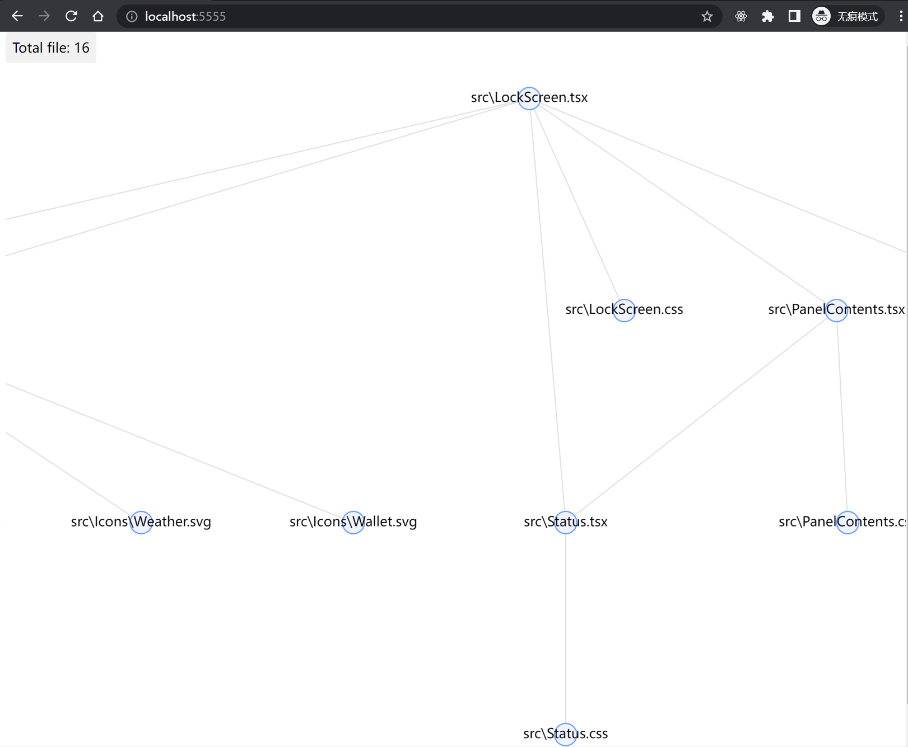

<p align="center">
  <h1 align="center">Anadep</h1>
  <div align="center">Analyze Dependencies</div>
</p>

> A lib can help you find all dependencies of the `js` file, also `jsx`,`ts`,`tsx` file.

## Install

```bash
# with npm
npm install -g anadep

# or yarn/pnpm ...
```

Of course, the simplest way is to use `npx`.

```bash
npx anadep [file]
```

## Usage

```bash
$ anadep help
index.js <file>

parse file

Positionals:
  file  file path                                                       [string]

Options:
      --version  Show version number                                   [boolean]
  -p, --port     server port                                     [default: 5555]
  -o, --output   output format                       [choices: "json", "stdout"]
  -h, --help     Show help                                             [boolean]
```

## Usage example

### 1. Inspect the result in you browser

```bash
# run
$ anadep ./src/LockScreen.tsx
You can inspect the result in you browser. http://localhost:5555

# you can use -p=3000 to set the port to 3000.
```

then open [http://localhost:5555](http://localhost:5555) in the browser,
you can double click on the graph node to open it in vscode.



### 2. Print all dependent files

this is very useful when you want to pipe the result in terminal.

```bash
$ anadep ./src/LockScreen.tsx -o=stdout
/user/xx/WorkSpace/react-iphone/src/LockScreen.tsx
/user/xx/WorkSpace/WebstormProjects/react-iphone/src/hooks/use-measure.ts
# ......
```

### 3. Save the tree of dependencies as json

```bash
$ anadep ./src/LockScreen.tsx -o=json
# then you can find a file `output.json` in your pwd.
```
