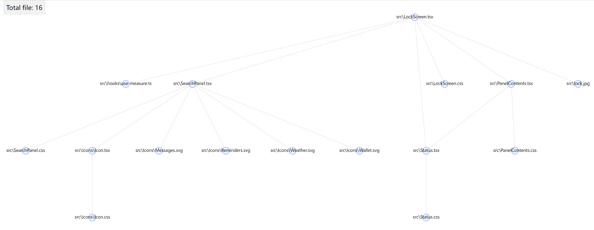

# <center>anadep</center>

> A lib can help you find all dependencies of the `js` file, also `jsx`,`ts`,`tsx` file.

## Install

```bash
# with npm
npm install -g anadep

# or yarn/pnpm ...
```

Of course, the simplest way is to use `npx`.

```bash
npx anadep [file]
```

## Usage

```bash
# run
$ anadep src/example.jsx
look at http://localhost:5555
```

then open [http://localhost:5555](http://localhost:5555) in the browser,
you can double click on the graph node to open it in vscode.


